# DCR Country Scoping

## Concept

Country scoping allows organizations operating in multiple countries to manage DCR field governance differently per country. A field can be governed globally (all countries) or scoped to a specific country.

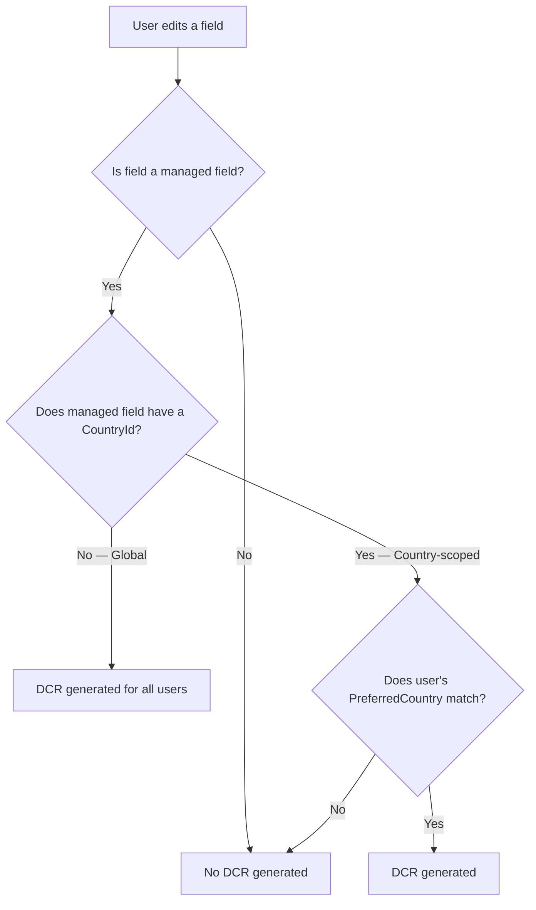

## Global vs. Country-Scoped Fields

| | Global Field | Country-Scoped Field |
|---|---|---|
| **CountryId** | Blank / null | Set to a specific LifeSciCountry |
| **Applies to** | All users regardless of country | Only users whose PreferredCountry matches |
| **Use case** | Fields that must be governed everywhere | Fields with country-specific regulations |
| **Admin LWC badge** | Grey "Global" | Blue "Country" |

## How It Works

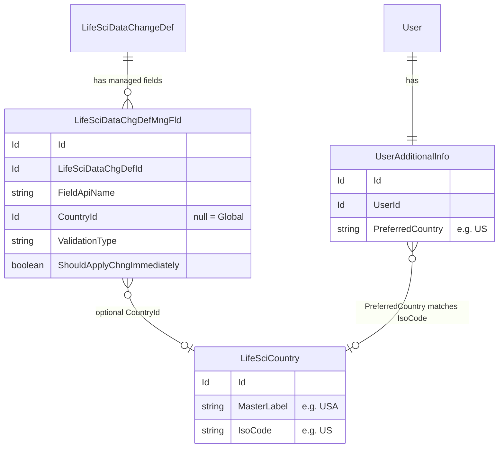

### The matching chain

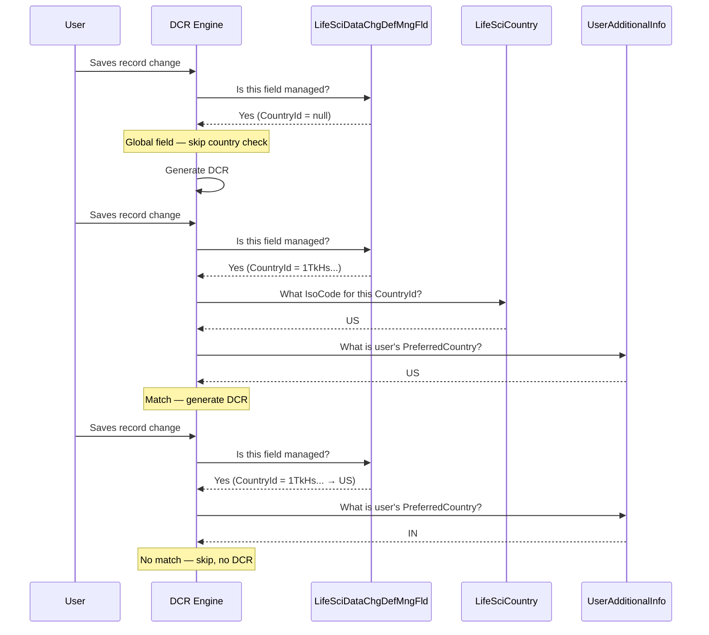

## Country Scoping Across Config Layers

Country scoping applies to managed fields and record type mappings, but NOT to persona definitions:

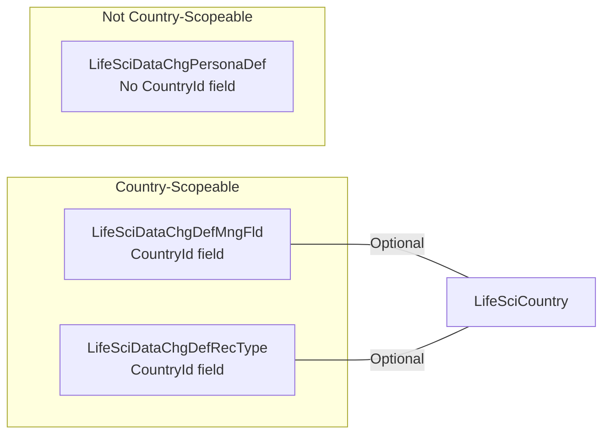

| Config Record | Has CountryId? | Behavior when set | Behavior when blank |
|---|---|---|---|
| `LifeSciDataChgDefMngFld` | Yes | Only governs this field for users in that country | Governs this field for all users |
| `LifeSciDataChgDefRecType` | Yes | Only applies this record type routing for that country | Applies for all countries |
| `LifeSciDataChgPersonaDef` | No | N/A | Always applies globally per profile |

## Example: Multi-Country Setup

An organization operates in the US and India. They want:
- `ProfessionalTitle` governed in both countries (different validation)
- `ProviderType` governed only in the US
- `ProviderClass` governed only in India

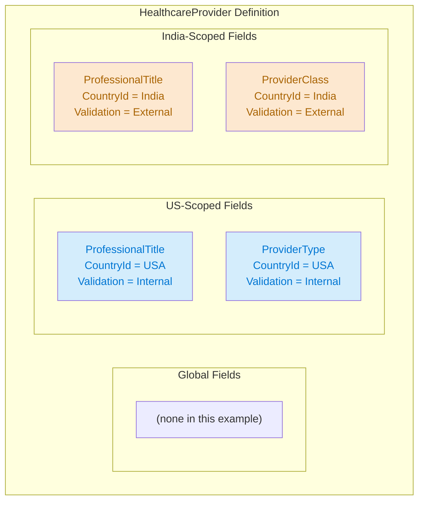

Notice that `ProfessionalTitle` appears twice — once scoped to US (Internal validation) and once scoped to India (External validation). This allows the same field to have different governance rules per country.

### What each user sees

| User | PreferredCountry | Edits ProfessionalTitle | Edits ProviderType | Edits ProviderClass |
|---|---|---|---|---|
| US rep | US | DCR (Internal) | DCR (Internal) | No DCR |
| India rep | IN | DCR (External) | No DCR | DCR (External) |

## Versus Global Fields

If you want a field governed the same way everywhere, create a **single global managed field** (no CountryId):

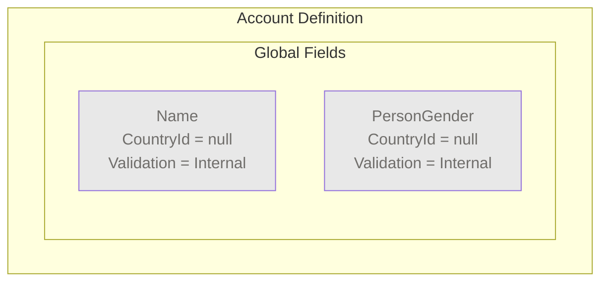

All users, regardless of country, generate DCRs when editing these fields.

## Admin LWC Behavior

The DCR Field Manager admin LWC uses the Country dropdown to control what's displayed:

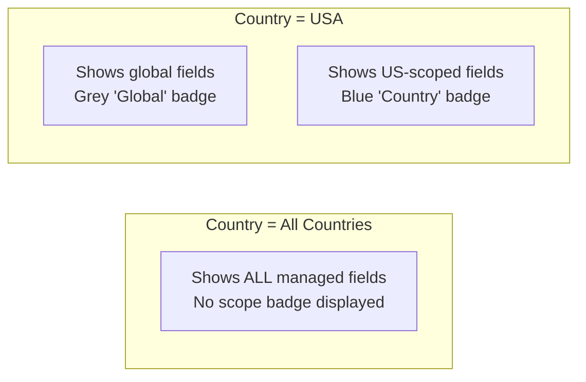

- **All Countries** — Shows every managed field across all definitions. No scope badge. Toggling a field on creates a **global** managed field (no CountryId).
- **Specific country** — Shows global fields plus fields scoped to that country. Toggling a field on creates a **country-scoped** managed field with the selected country's Id. Global fields display an **"Override"** button — clicking it creates a country-specific managed field record that can have a different validation type than the global default.

## Country-Specific Validation Type Overrides

Country scoping doesn't just apply to managed fields — it also applies to **record type mappings** (`LifeSciDataChgDefRecType`). This lets you set a global default validation path and then override it for specific countries.

### The Problem

Your org uses IQVIA OneKey as the external validation system for HCP and HCO globally. But:
- **GB (United Kingdom)** needs **Internal** validation — your UK data stewards handle it
- Or perhaps GB uses a **different external system** entirely

You can't just change the global "All" row — that would break every other country.

### The Solution: Add Country Overrides

In the **Data Change Request Validation Types** screen, each record type row has an **"Add Country"** button. Clicking it creates a country-specific override row that takes precedence over the "All" default for users in that country.

#### Starting Point: Global External Validation

| Record Type | Country | Validation Type | Requires Approval | External System |
|---|---|---|---|---|
| Health Care Provider | All | External | No | OneKey |
| Health Care Organization | All | External | No | OneKey |

This sends all HCP and HCO changes to OneKey, regardless of user country.

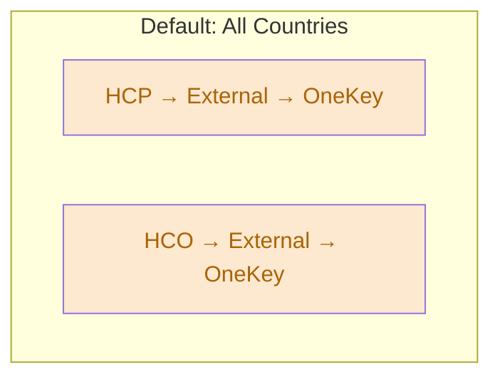

#### After Adding Country Overrides

Click **"Add Country"** on the HCP row to add country-specific overrides:

| Record Type | Country | Validation Type | Requires Approval | External System |
|---|---|---|---|---|
| Health Care Provider | All | External | No | OneKey |
| Health Care Provider | United Kingdom | External | Yes | HSJ |
| Health Care Provider | Canada | Internal | No | — |
| Health Care Organization | All | External | No | OneKey |

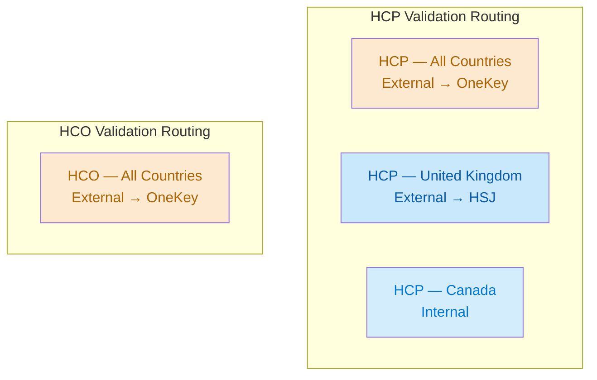

### How the Engine Resolves Country Overrides

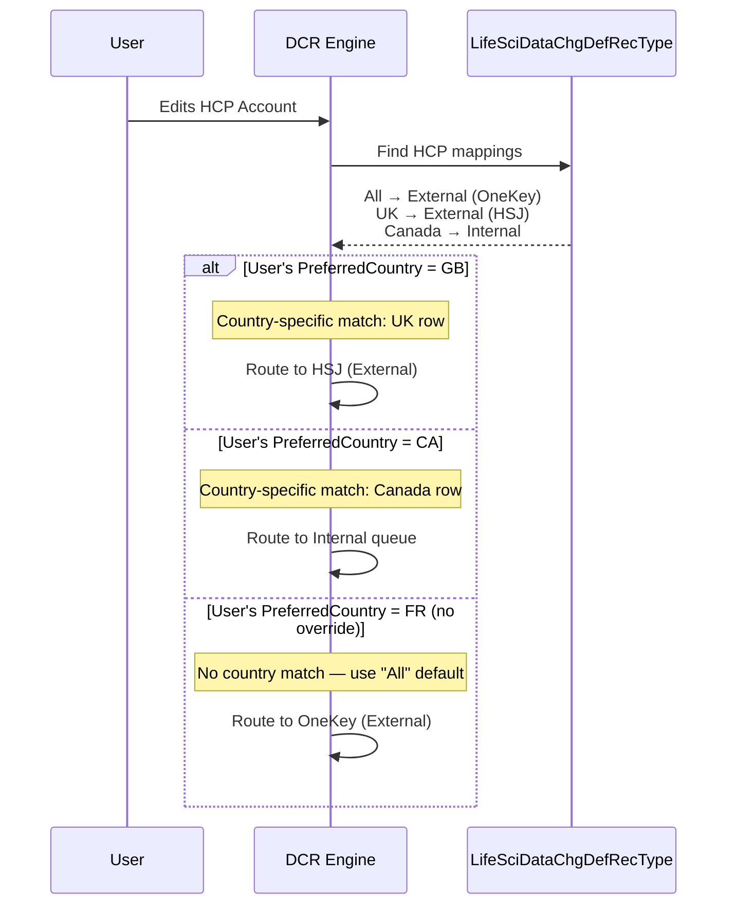

The precedence rule: **a country-specific row always wins over the "All" default** for users in that country. Users in countries without a specific override fall back to the "All" row.

### What Each User Sees

| User Country | HCP Validation | HCO Validation |
|---|---|---|
| United Kingdom (GB) | External → HSJ | External → OneKey |
| Canada (CA) | Internal (data steward) | External → OneKey |
| France (FR) | External → OneKey (default) | External → OneKey |
| USA (US) | External → OneKey (default) | External → OneKey |

Notice that the HCO row has no country overrides, so all countries use the same "All → External → OneKey" path for HCO changes.

### Setting Up GB as Internal (Your Scenario)

If you want GB to use **Internal** validation for HCP while HCP and HCO are External globally:

1. Go to **Setup > Data Change Request Validation Types**
2. Select **Account** object
3. On the **Health Care Provider** row (which shows All / External / OneKey), click **"Add Country"**
4. A new row appears — set:
   - **Country:** United Kingdom
   - **Validation Type:** Internal
   - **Requires Approval for Creation:** toggle as needed
   - **External Validation System Name:** leave blank (not needed for Internal)
5. Click **Save**

Now UK users editing HCP accounts generate Internal DCRs reviewed by your data stewards, while all other countries continue routing to OneKey.

> **Important:** You also need managed fields with `ValidationType = Internal` for the fields you want governed in GB. If your managed fields are all set to `External`, the engine won't find a matching path for UK users — the record type mapping says Internal, but the managed field says External, causing a mismatch. Either create country-scoped managed fields for GB with `ValidationType = Internal`, or use globally scoped fields that already have `ValidationType = Internal`.

## Common Pitfalls

### 1. User's PreferredCountry must match a LifeSciCountry record

Even for global fields, the DCR engine resolves the user's `PreferredCountry` against `LifeSciCountry` records. If no matching record exists, DCRs are silently skipped.

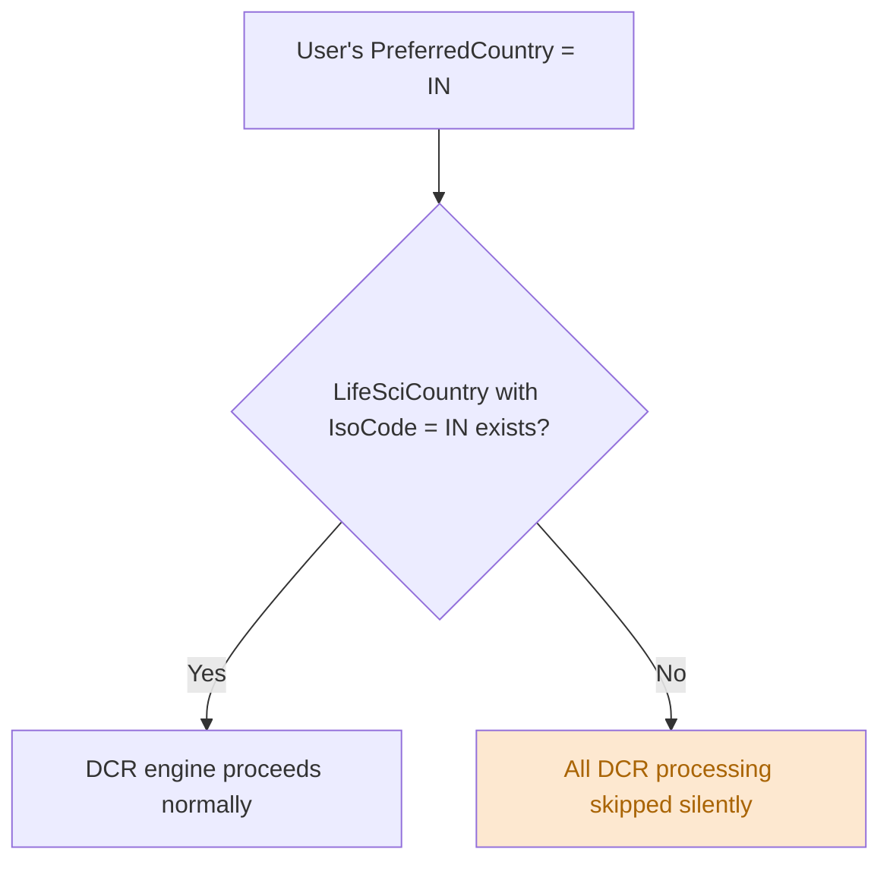

### 2. Duplicate field with different countries

You can have the same field managed twice — once global and once country-scoped, or scoped to two different countries. The DCR engine evaluates each managed field record independently. This can result in **multiple DCRs** for a single field change if the user matches more than one.

### 3. Country filter only affects managed fields

Record type mappings (`LifeSciDataChgDefRecType`) also support `CountryId`, but persona definitions (`LifeSciDataChgPersonaDef`) do not. When planning a multi-country rollout, remember that profile-based behavior is always global.

### 4. Country override on record type mapping without matching managed field ValidationType

If you add a country override that changes the validation type (e.g., UK → Internal on an otherwise External HCP row), you must also have managed fields whose `ValidationType` matches. A record type mapping alone doesn't generate DCRs — it only defines the routing. The managed field's `ValidationType` must align with the record type mapping's `ValidationType` for that country. Otherwise: silent failure, no DCR.
