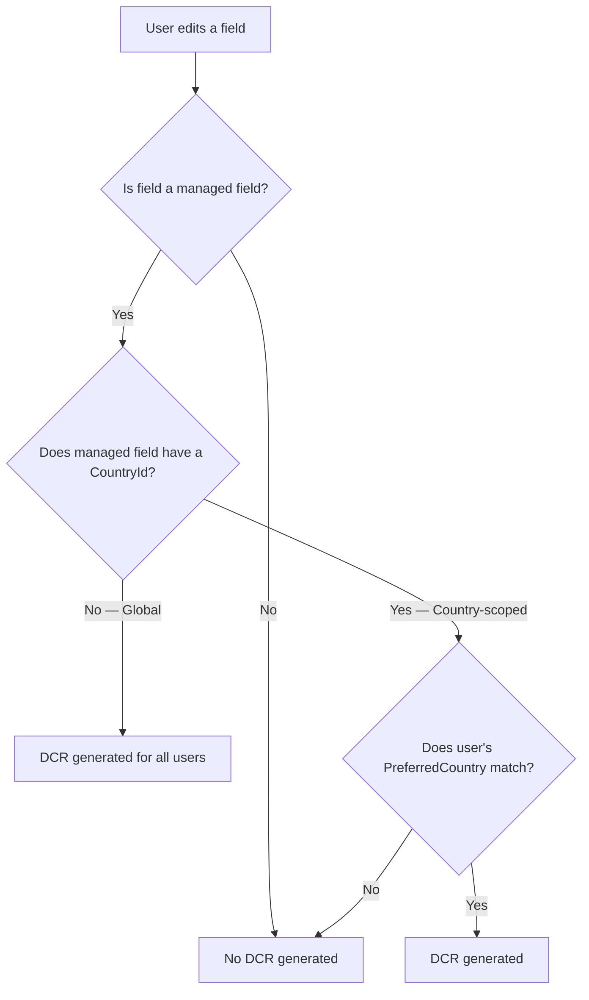
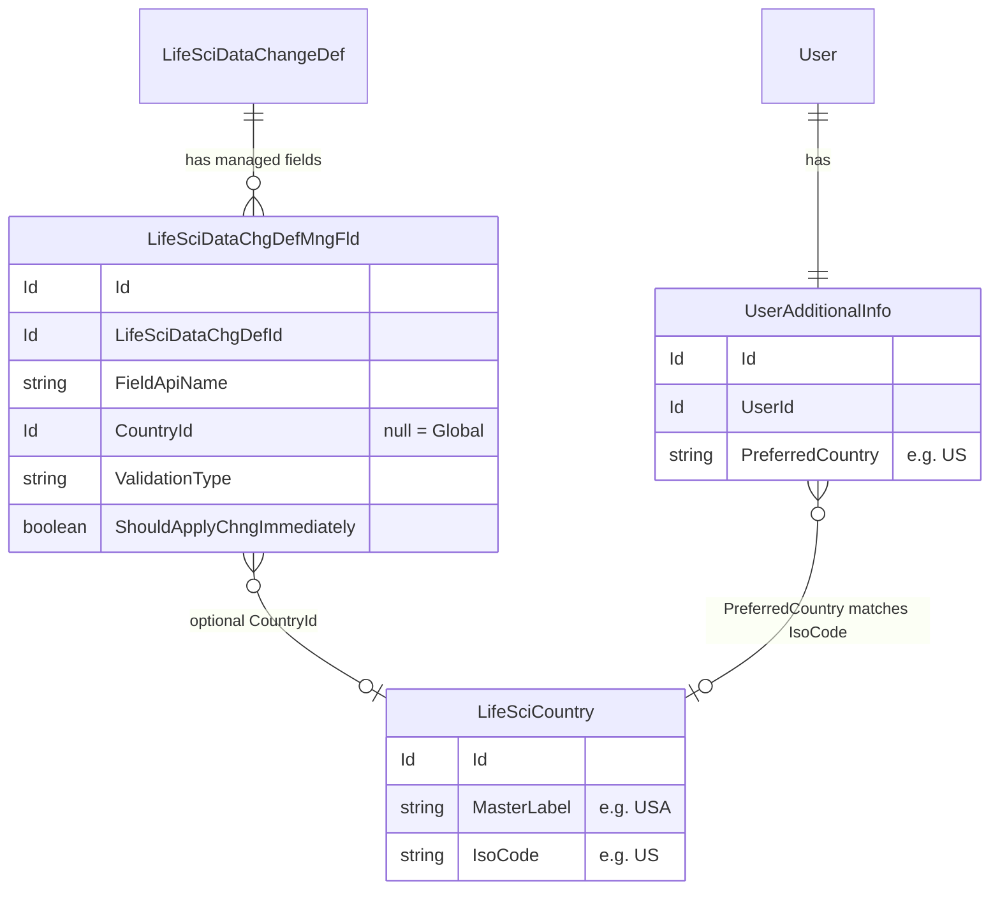
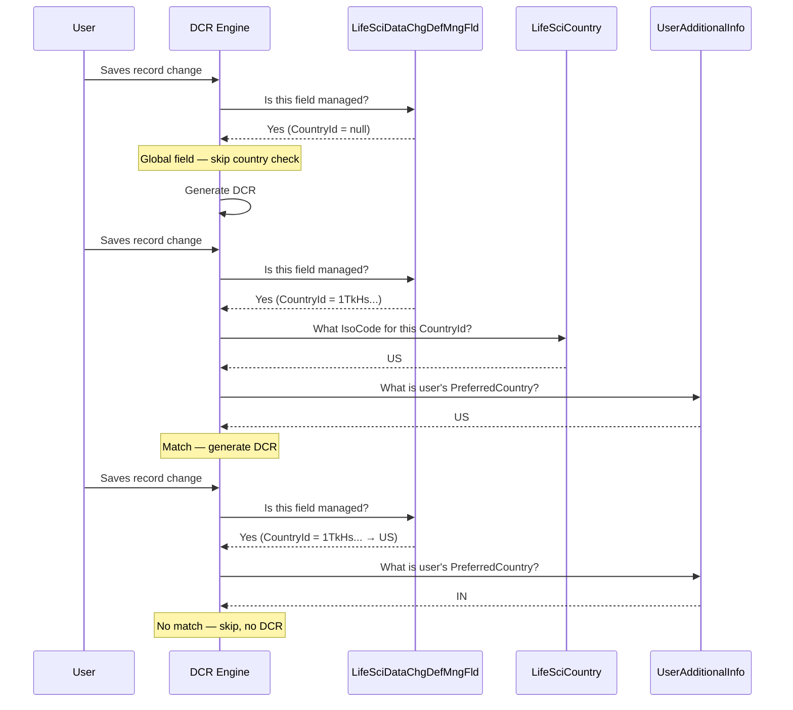
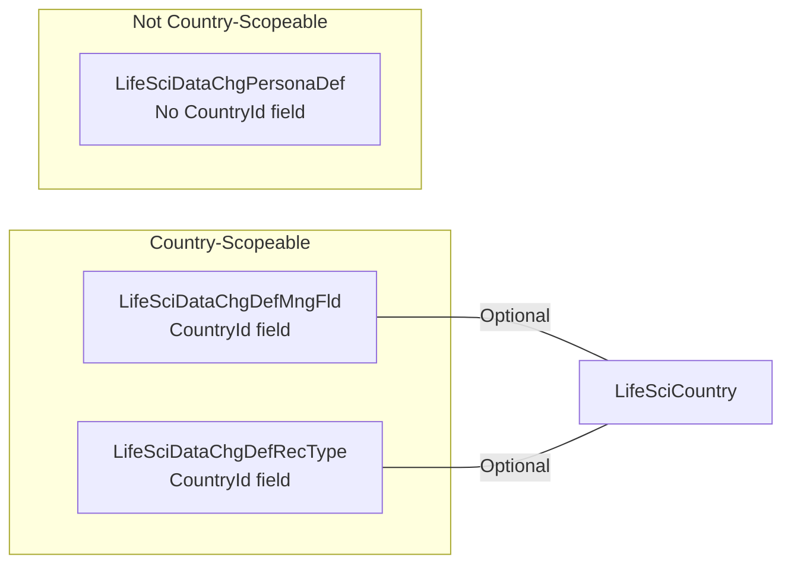
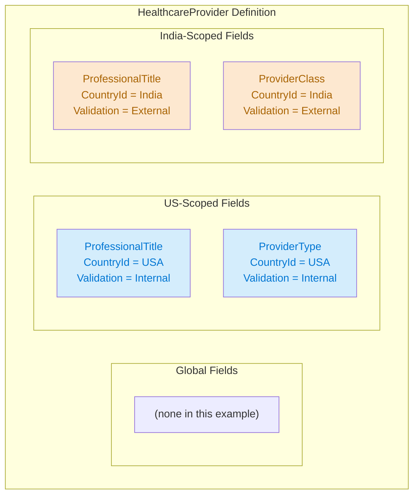
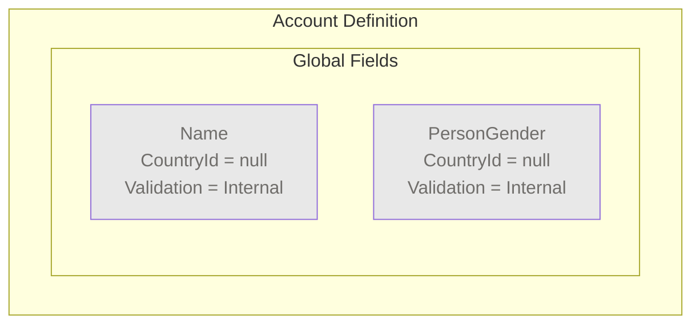
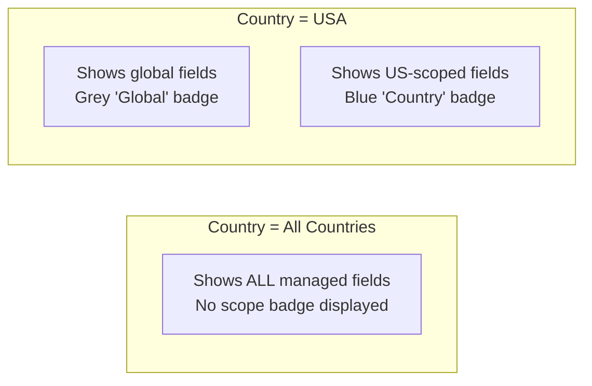
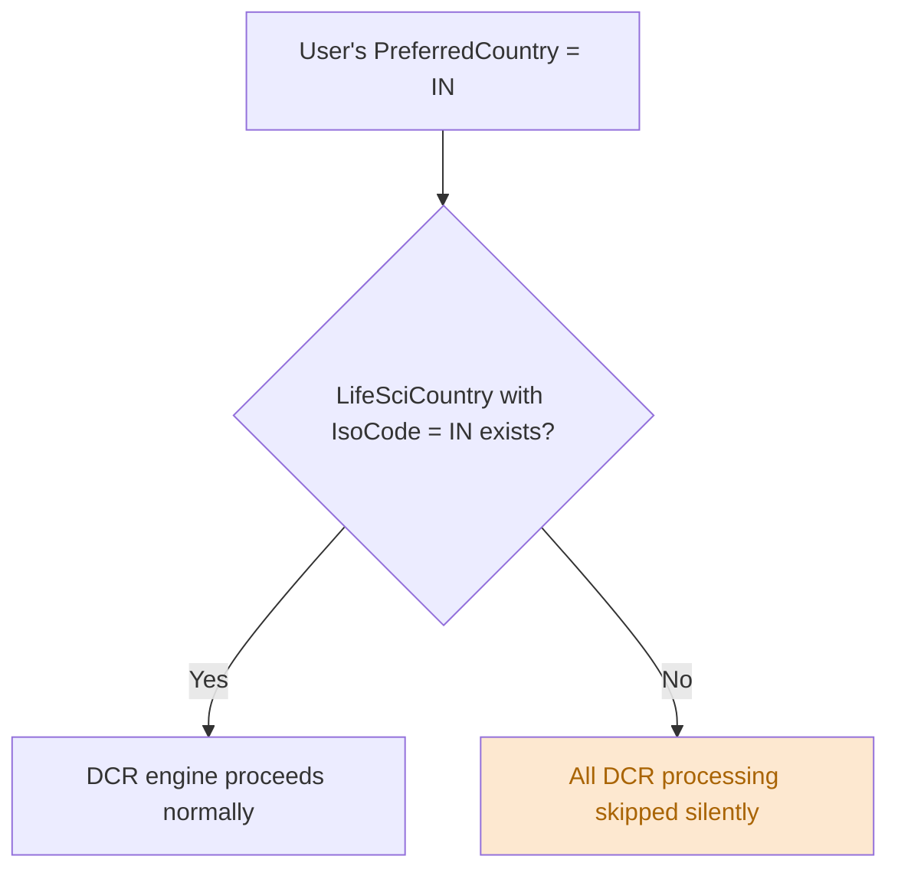

# DCR Country Scoping

## Concept

Country scoping allows organizations operating in multiple countries to manage DCR field governance differently per country. A field can be governed globally (all countries) or scoped to a specific country.

## Global vs. Country-Scoped Fields

| | Global Field | Country-Scoped Field |
|---|---|---|
| **CountryId** | Blank / null | Set to a specific LifeSciCountry |
| **Applies to** | All users regardless of country | Only users whose PreferredCountry matches |
| **Use case** | Fields that must be governed everywhere | Fields with country-specific regulations |
| **Admin LWC badge** | Grey "Global" | Blue "Country" |

## How It Works

### The matching chain

## Country Scoping Across Config Layers

Country scoping applies to managed fields and record type mappings, but NOT to persona definitions:

| Config Record | Has CountryId? | Behavior when set | Behavior when blank |
|---|---|---|---|
| `LifeSciDataChgDefMngFld` | Yes | Only governs this field for users in that country | Governs this field for all users |
| `LifeSciDataChgDefRecType` | Yes | Only applies this record type routing for that country | Applies for all countries |
| `LifeSciDataChgPersonaDef` | No | N/A | Always applies globally per profile |

## Example: Multi-Country Setup

An organization operates in the US and India. They want:
- `ProfessionalTitle` governed in both countries (different validation)
- `ProviderType` governed only in the US
- `ProviderClass` governed only in India

Notice that `ProfessionalTitle` appears twice — once scoped to US (Internal validation) and once scoped to India (External validation). This allows the same field to have different governance rules per country.

### What each user sees

| User | PreferredCountry | Edits ProfessionalTitle | Edits ProviderType | Edits ProviderClass |
|---|---|---|---|---|
| US rep | US | DCR (Internal) | DCR (Internal) | No DCR |
| India rep | IN | DCR (External) | No DCR | DCR (External) |

## Versus Global Fields

If you want a field governed the same way everywhere, create a **single global managed field** (no CountryId):

All users, regardless of country, generate DCRs when editing these fields.

## Admin LWC Behavior

The DCR Field Manager admin LWC uses the Country dropdown to control what's displayed:

- **All Countries** — Shows every managed field across all definitions. No scope badge. Toggling a field on creates a **global** managed field (no CountryId).
- **Specific country** — Shows global fields plus fields scoped to that country. Toggling a field on creates a **country-scoped** managed field with the selected country's Id.

## Common Pitfalls

### 1. User's PreferredCountry must match a LifeSciCountry record

Even for global fields, the DCR engine resolves the user's `PreferredCountry` against `LifeSciCountry` records. If no matching record exists, DCRs are silently skipped.

### 2. Duplicate field with different countries

You can have the same field managed twice — once global and once country-scoped, or scoped to two different countries. The DCR engine evaluates each managed field record independently. This can result in **multiple DCRs** for a single field change if the user matches more than one.

### 3. Country filter only affects managed fields

Record type mappings (`LifeSciDataChgDefRecType`) also support `CountryId`, but persona definitions (`LifeSciDataChgPersonaDef`) do not. When planning a multi-country rollout, remember that profile-based behavior is always global.
