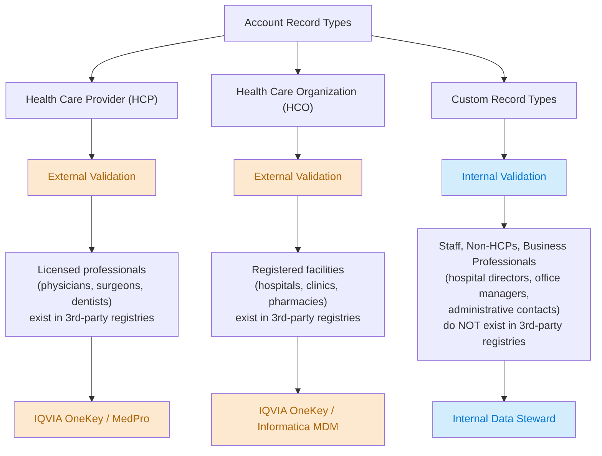
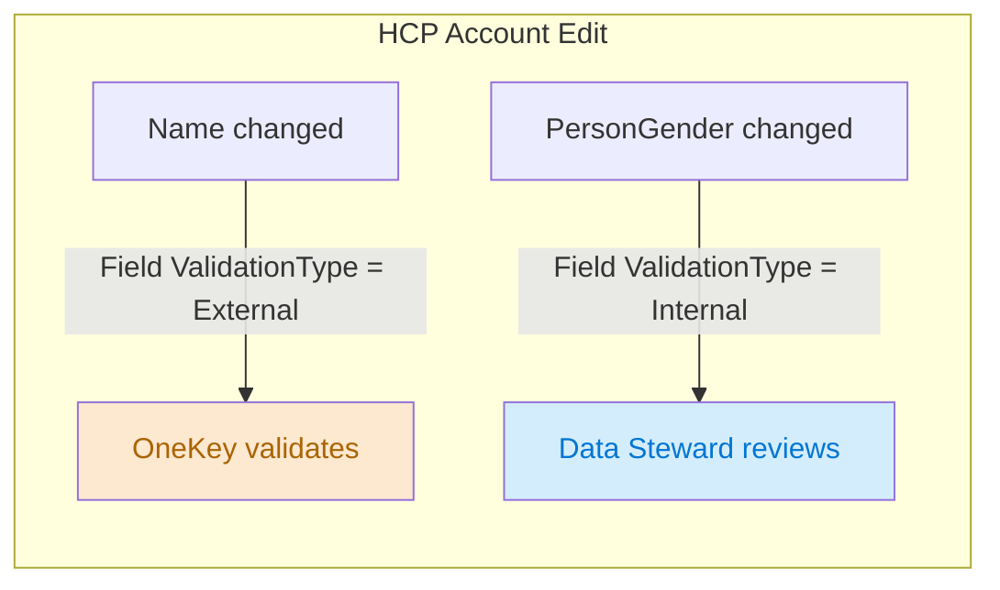

# DCR Record Type Routing

## Why Record Types Matter

Life Sciences organizations manage fundamentally different categories of people and entities. The DCR engine uses **Account record types** to determine how each data change is validated — either by an external third-party data provider or by your internal data stewards.

### External Validation (HCP / HCO)

Health Care Providers and Health Care Organizations are typically **externally validated** because third-party data providers maintain authoritative registries of licensed professionals and registered facilities:

- **IQVIA OneKey** — the industry-standard global registry for HCPs and HCOs. Maintains credentials, affiliations, specialties, and facility details.
- **MedPro** — provider credentialing and verification services.
- **Informatica MDM** — master data management used for HCO validation.

When a field rep updates an HCP or HCO account, the DCR is sent to the external provider to verify the change against their registry before it is applied in Salesforce. This keeps your data aligned with the industry source of truth.

### Internal Validation (Custom Record Types)

Custom record types like **Staff**, **Non-HCP**, or **Business Professional** (hospital directors, procurement managers, administrative contacts) are **internally validated** because third-party data providers have no registry for these individuals. They don't hold medical licenses and aren't tracked by IQVIA or MedPro.

Changes to these accounts are routed to your organization's internal data stewards for review and approval.

## Where to Configure

**Admin Console > Data Change Request Validation Types** (left nav)

This page shows each object with its record type mappings. For each mapping you configure:

| Column | Purpose |
|---|---|
| Record Type | The Account record type (e.g., Health Care Provider, Health Care Organization) |
| Country | Country scope — "All" for global, or a specific country |
| Validation Type | `Internal` or `External` |
| Requires Approval for Creation | Whether new record creation needs approval (Internal only) |
| External Validation System Name | The external system name (e.g., OneKey, InformaticaMDM) — only for External |

### Typical Account Configuration

| Record Type | Validation Type | External System | Rationale |
|---|---|---|---|
| Health Care Provider | External | OneKey | Licensed professionals — verified by IQVIA |
| Health Care Organization | External | OneKey | Registered facilities — verified by IQVIA |
| Staff | Internal | — | Not in external registries |
| Non-HCP | Internal | — | Not in external registries |
| Business Professional | Internal | — | Not in external registries |
| Person Account | Internal | — | Not in external registries |

## Mixed Validation on the Same Record Type

Some organizations need both Internal and External validation for the same record type. For example, an HCP account might have:
- `Name` → External (must match IQVIA registry)
- `PersonGender` → Internal (not tracked by IQVIA)

This works by creating **two** record type mappings for the same Account record type — one Internal, one External. The managed field's `ValidationType` determines which path each field follows.

If both fields change in the same save, two separate DCR records are created — one routed externally, one internally.

## Related Objects Inherit the Pattern

Related objects (HealthcareProvider, ContactPointAddress, BusinessLicense, etc.) also need their own record type mappings, but they reference **Account record types** — not record types on the target object itself. The parent Account's record type determines the validation path for all its child objects.

| Object | Record Type | Validation Type |
|---|---|---|
| Account | Health Care Provider | External |
| HealthcareProvider | Health Care Provider | External |
| ContactPointAddress | Health Care Provider | External |
| ContactPointEmail | Health Care Provider | Internal |
| BusinessLicense | Health Care Provider | Internal |

Each row is a separate `LifeSciDataChgDefRecType` record. Without a mapping on the child object's definition, the DCR engine silently skips it — even if the parent Account has a mapping.

## Validation Type Alignment

The `ValidationType` on the managed field **must match** the `ValidationType` on the record type mapping. Mismatches cause silent failures:

| RecType Mapping | Managed Field | Result |
|---|---|---|
| Internal | Internal | DCR generated |
| External | External | DCR generated |
| Internal | External | **No DCR — silent skip** |
| External | Internal | **No DCR — silent skip** |

This is the most common reason DCRs fail silently. When troubleshooting, always verify both sides match.

## See Also

- [VALIDATION_TYPES.md](VALIDATION_TYPES.md) — detailed validation routing logic, external system integration requirements, and complete setup examples
- [README.md](README.md) — DCR Object Reference table and setup checklist
