# Data Change Request (DCR) Setup Guide

## Overview

Data Change Request (DCR) governs how data changes are submitted, validated, and implemented across LSC for Customer Engagement. It prevents unapproved changes from being applied and ensures data consistency across web and mobile apps.

**Supported Objects:** Account, HealthcareProvider, HealthcareProviderSpecialty, HealthcareProviderNpi, ContactPointAddress, ContactPointPhone, ContactPointSocial, ContactPointEmail, BusinessLicense, ProviderAffiliation.

## Data Model

```mermaid
erDiagram
    Account ||--o{ HealthcareProvider : "AccountId"
    Account ||--o{ ContactPointAddress : "ParentId"
    Account ||--o{ ContactPointPhone : "ParentId"
    Account ||--o{ ContactPointEmail : "ParentId"
    Account ||--o{ ContactPointSocial : "ParentReferenceRecordId"
    Account ||--o{ BusinessLicense : "AccountId"
    Account ||--o{ ProviderAffiliation : "AccountId / RelatedAccountId"
    HealthcareProvider ||--o{ HealthcareProviderNpi : "PractitionerId"
    HealthcareProvider ||--o{ HealthcareProviderSpecialty : "PractitionerId"

    LifeSciDataChangeDef ||--o{ LifeSciDataChgDefMngFld : "LifeSciDataChgDefId"
    LifeSciDataChangeDef ||--o{ LifeSciDataChgDefRecType : "LifeSciDataChgDefId"
    LifeSciDataChangeDef ||--o{ LifeSciDataChgPersonaDef : "LifeSciDataChgDefId"
    LifeSciDataChangeDef ||--o{ LifeSciDataChangeRequest : "LifeSciDataChgDefId"
    LifeSciDataChangeRequest ||--o{ LifeSciDataChangeRequest : "ParentDataChangeRequestId"

    Account {
        Id Id
        string Name
        string RecordTypeId
    }
    HealthcareProvider {
        Id Id
        Id AccountId
        string ProfessionalTitle
        string ProviderType
    }
    ContactPointAddress {
        Id Id
        Id ParentId
        string Address
    }
    ContactPointPhone {
        Id Id
        Id ParentId
    }
    ContactPointEmail {
        Id Id
        Id ParentId
    }
    ContactPointSocial {
        Id Id
        Id ParentReferenceRecordId
    }
    BusinessLicense {
        Id Id
        Id AccountId
    }
    ProviderAffiliation {
        Id Id
        Id AccountId
        Id RelatedAccountId
        string Role
    }
    HealthcareProviderNpi {
        Id Id
        Id PractitionerId
    }
    HealthcareProviderSpecialty {
        Id Id
        Id PractitionerId
        Id SpecialtyId
    }
    LifeSciDataChangeDef {
        Id Id
        string DeveloperName
        string ObjectName
        boolean IsActive
    }
    LifeSciDataChgDefMngFld {
        Id Id
        Id LifeSciDataChgDefId
        string FieldApiName
        boolean ApplyChangeImmediately
        string ValidationType
    }
    LifeSciDataChgDefRecType {
        Id Id
        Id LifeSciDataChgDefId
        Id RecordTypeId
        string ValidationType
        boolean NewRecApprovalRequired
    }
    LifeSciDataChgPersonaDef {
        Id Id
        Id LifeSciDataChgDefId
        Id ProfileId
        string ChangeUpdateType
        boolean IsActive
    }
    LifeSciDataChangeRequest {
        Id Id
        string Name
        Id LifeSciDataChgDefId
        Id ParentDataChangeRequestId
        string Status
        string OperationType
        string ValidationType
        string DataChangeRecordIdentifier
        text DataChangeInformation
    }
```

The `LifeSciDataChangeRequest` has **no direct Account lookup**. The account relationship is indirect -- `DataChangeRecordIdentifier` stores the ID of the changed record (e.g., a HealthcareProvider), and the `DataChangeInformation` JSON contains the `accountid` field within the old/new data payloads.

## Setup Checklist

### 1. Data Change Definitions

Activate Data Change Definitions for each object you want DCR to govern:

**Admin Console > Account Management > Data Change Request > Object Status**

### 2. Managed Fields (CRITICAL)

Create `LifeSciDataChgDefMngFld` records to define which fields are tracked for changes. Without these, DCR will not trigger.

**Steps:**
1. App Launcher > **Life Science Data Change Definition Managed Fields** > New
2. Name format: `ObjectName_FieldApiName` (e.g., `Account_Name`)
3. Select the parent Data Change Definition (e.g., Account)
4. Enter the Field API Name
5. Set validation type (Internal or External — must match the record type definition)
6. Optionally set "Apply Change Immediately" per field
7. Repeat for all governed fields

**Mandatory fields for External validation:**

| Object | Required Fields |
|---|---|
| Account | Name, Phone, Fax, PersonGender, PersonMobilePhone, PersonBirthdate |
| ContactPointAddress | Name, Address |
| HealthcareProvider | Name, Status, ProfessionalTitle, TotalLicensedBeds, ProviderType, ProviderClass |
| HealthcareProviderSpecialty | Name, SpecialtyId |
| ProviderAffiliation | Role, EffectiveStartDate, EffectiveEndDate |

### 3. Record Type & Persona Definitions

Configure record type definitions (Internal vs External validation) and persona definitions (which profiles require DCR approval) for each governed object:

**Admin Console > Account Management > Data Change Request**

### 4. DCRHandler Trigger Verification

Confirm the DCRHandler trigger handler is active:

**Admin Console > Trigger Handler Administration**

DCRHandler should be active by default.

### 5. UserAdditionalInfo Records

Create `UserAdditionalInfo` records for authenticated users with:
- Preferred country
- Available country sets
- Associated `LifeSciCountry` records

This is required for country-specific validation routing.

### 6. DCR Approval Tab

Create a Lightning Component Tab for approving/rejecting DCRs:

1. Setup > Tabs > Lightning Component Tabs > New
2. Select component: `lsc4ce:dataChangeListWithApproveReject`
3. Set label, name, and assign to appropriate profiles

### 7. Mobile DB Schema Records

Ensure these DB Schema records exist and are active:

| DB Schema Record | Type |
|---|---|
| DbSchema_LifeSciDataChangeDef | Configuration |
| DbSchema_LifeSciDataChgDefRecType | Configuration |
| DbSchema_LifeSciDataChgPersonaDef | Configuration |
| DbSchema_LifeSciDataChangeRequest | Data |
| DbSchema_LifeSciDataChgDefMngFld | Data |
| DbSchema_UserAdditionalInfo | Data |
| DbSchema_LifeSciCountry | Data |

After creating/verifying, **regenerate the metadata cache**.

## How to Trigger a DCR

Once setup is complete:

1. **Log in as a user** whose profile is configured with "Don't apply changes immediately"
2. **Edit a record** on a DCR-enabled object — change a field that has a managed field definition
3. **Save** — the system creates a `LifeSciDataChangeRequest` record automatically
4. **On mobile**: Update records via Account Details, Related tab, or Bulk Updates — changes sync and create DCRs
5. **Admin approves/rejects** via the DCR approval tab or directly on the record

## DCR Behavior by Profile Setting

| Setting | Web Behavior | Mobile Behavior |
|---|---|---|
| Don't apply changes immediately | DCR sent for approval first | Changes appear after approval + next sync |
| Apply changes immediately | Changes applied; DCR created for review | Changes applied immediately; reverted on next sync if rejected |
| Apply changes to each field individually | Per-field control via managed field config | Per-field control via managed field config |

## Validation Types

| Type | Managed By | Notes |
|---|---|---|
| Internal | Your organization | Supports "Requires Approval" toggle for record creation |
| External | External validation system (e.g., OneKey, Informatica MDM) | Only Create and Update operations supported; Delete is rejected |

## External Validation Requirements

- **Create HCO**: Must include Account, ContactPointAddress, HealthcareProvider, HealthcareProviderSpecialty
- **Create HCP**: Must include all HCO objects + ProviderAffiliation
- **Person Account**: Requires at least one primary Provider Affiliation and one primary Healthcare Provider Specialty
- **Business Account**: Requires at least one primary Healthcare Provider Specialty
- **Picklist Alignment**: Every Salesforce picklist value must have a corresponding mapping in your integration layer or the DCR will fail with "Missing Fields" error

## DCR Status Flow

`NotProcessed` > `Qualified` / `NotQualified` > `Processed` / `Failed` > `Approved` / `Rejected` / `Retry`

## LWC Component: lscMobileInline_DCR_Overview

A compact LWC that shows pending Data Change Requests on an Account record page. Renders nothing when there are no pending DCRs; shows an expandable banner with before/after field diffs when there are. Uses GraphQL — no Apex controller required.

See the full component documentation: [force-app/main/default/lwc/lscMobileInline_DCR_Overview/README.md](force-app/main/default/lwc/lscMobileInline_DCR_Overview/README.md)
