# Data Change Request (DCR) Setup Guide

## Overview

Data Change Request (DCR) governs how data changes are submitted, validated, and implemented across LSC for Customer Engagement. It prevents unapproved changes from being applied and ensures data consistency across web and mobile apps.

**Supported Objects:** Account, HealthcareProvider, HealthcareProviderSpecialty, HealthcareProviderNpi, ContactPointAddress, ContactPointPhone, ContactPointSocial, ContactPointEmail, BusinessLicense, ProviderAffiliation.

## Data Model

```mermaid
erDiagram
    Account ||--o{ HealthcareProvider : "AccountId"
    Account ||--o{ ContactPointAddress : "ParentId"
    Account ||--o{ ContactPointPhone : "ParentId"
    Account ||--o{ ContactPointEmail : "ParentId"
    Account ||--o{ ContactPointSocial : "ParentReferenceRecordId"
    Account ||--o{ BusinessLicense : "AccountId"
    Account ||--o{ ProviderAffiliation : "AccountId / RelatedAccountId"
    HealthcareProvider ||--o{ HealthcareProviderNpi : "PractitionerId"
    HealthcareProvider ||--o{ HealthcareProviderSpecialty : "PractitionerId"

    LifeSciDataChangeDef ||--o{ LifeSciDataChgDefMngFld : "LifeSciDataChgDefId"
    LifeSciDataChangeDef ||--o{ LifeSciDataChgDefRecType : "LifeSciDataChgDefId"
    LifeSciDataChangeDef ||--o{ LifeSciDataChgPersonaDef : "LifeSciDataChgDefId"
    LifeSciDataChangeDef ||--o{ LifeSciDataChangeRequest : "LifeSciDataChgDefId"
    LifeSciDataChangeRequest ||--o{ LifeSciDataChangeRequest : "ParentDataChangeRequestId"

    Account {
        Id Id
        string Name
        string RecordTypeId
    }
    HealthcareProvider {
        Id Id
        Id AccountId
        string ProfessionalTitle
        string ProviderType
    }
    ContactPointAddress {
        Id Id
        Id ParentId
        string Address
    }
    ContactPointPhone {
        Id Id
        Id ParentId
    }
    ContactPointEmail {
        Id Id
        Id ParentId
    }
    ContactPointSocial {
        Id Id
        Id ParentReferenceRecordId
    }
    BusinessLicense {
        Id Id
        Id AccountId
    }
    ProviderAffiliation {
        Id Id
        Id AccountId
        Id RelatedAccountId
        string Role
    }
    HealthcareProviderNpi {
        Id Id
        Id PractitionerId
    }
    HealthcareProviderSpecialty {
        Id Id
        Id PractitionerId
        Id SpecialtyId
    }
    LifeSciDataChangeDef {
        Id Id
        string DeveloperName
        string ObjectName
        boolean IsActive
    }
    LifeSciDataChgDefMngFld {
        Id Id
        Id LifeSciDataChgDefId
        string FieldApiName
        boolean ApplyChangeImmediately
        string ValidationType
        Id CountryId
    }
    LifeSciDataChgDefRecType {
        Id Id
        Id LifeSciDataChgDefId
        Id RecordTypeId
        string ValidationType
        boolean NewRecApprovalRequired
        Id CountryId
    }
    LifeSciDataChgPersonaDef {
        Id Id
        Id LifeSciDataChgDefId
        Id ProfileId
        string ChangeUpdateType
        boolean IsActive
    }
    LifeSciDataChangeRequest {
        Id Id
        string Name
        Id LifeSciDataChgDefId
        Id ParentDataChangeRequestId
        string Status
        string OperationType
        string ValidationType
        string DataChangeRecordIdentifier
        text DataChangeInformation
    }
```

The `LifeSciDataChangeRequest` has **no direct Account lookup**. The account relationship is indirect -- `DataChangeRecordIdentifier` stores the ID of the changed record (e.g., a HealthcareProvider), and the `DataChangeInformation` JSON contains the `accountid` field within the old/new data payloads.

## How DCR Works (Trigger Flow)

When a user saves a record change, the DCR engine runs in this order:

1. **LifeSciDataChangeDef** — Is there an active definition for this object?
2. **LifeSciDataChgPersonaDef** — Is the user's profile configured for DCR on this object? What is the `ChangeUpdateType`?
3. **LifeSciDataChgDefRecType** — Which DCR record type to use? Internal or External validation? Optional country scoping.
4. **LifeSciDataChgDefMngFld** — Which fields are governed? Only changes to managed fields generate a DCR.
5. **LifeSciDataChangeRequest** — A DCR record is created with old/new data in JSON format.

**All four configuration objects must be present for an object to generate DCRs.** Missing any one of them (Definition, Record Type, Persona, or Managed Fields) means no DCR will be created.

## Three-Legged Stool: Why All Three Config Records Matter

For DCR to trigger on any object, you need three child records under each `LifeSciDataChangeDef`:

| Config Record | Purpose | Country-Scoped? |
|---|---|---|
| `LifeSciDataChgDefRecType` | Maps a DCR record type and validation type (Internal/External) to the definition | Yes (optional `CountryId`) |
| `LifeSciDataChgPersonaDef` | Maps a user profile to the definition and controls how changes are applied | No |
| `LifeSciDataChgDefMngFld` | Defines which specific fields are tracked for changes | Yes (optional `CountryId`) |

**Common pitfall:** Activating a `LifeSciDataChangeDef` and adding managed fields is not enough. Without a `LifeSciDataChgDefRecType` and `LifeSciDataChgPersonaDef`, no DCR will be generated — the trigger silently skips the object.

## Setup Checklist

### 1. Data Change Definitions

Activate Data Change Definitions for each object you want DCR to govern:

**Admin Console > Account Management > Data Change Request > Object Status**

### 2. Record Type Definitions (REQUIRED)

Create `LifeSciDataChgDefRecType` records to map each definition to a DCR record type. This tells the platform which record type to stamp on new DCR records and whether to use Internal or External validation.

**Steps:**
1. App Launcher > **Life Science Data Change Definition Record Types** > New
2. Select the parent Data Change Definition (e.g., ContactPointAddress)
3. Select the DCR Record Type (from `LifeSciDataChangeRequest` record types)
4. Set Validation Type: `Internal` or `External`
5. Optionally set Country (only DCRs for records in that country will use this mapping)
6. Set "Is New Record Approval Required" as needed

**Or use the DCR Field Manager admin LWC** (see below) — click an object tile and use the "Add Record Type" button.

### 3. Persona Definitions (REQUIRED)

Create `LifeSciDataChgPersonaDef` records to define which user profiles trigger DCR processing and how their changes are handled.

**Steps:**
1. App Launcher > **Life Science Data Change Persona Definitions** > New
2. Select the parent Data Change Definition
3. Select a Profile (or leave blank for "All Profiles")
4. Set Change Update Type:
   - `DoNotApplyChangesImmediately` — Changes are held pending approval
   - `ApplyChangesImmediately` — Changes are applied immediately; DCR created for review
   - `ApplyChangesByField` — Per-field control using each managed field's "Apply Immediately" setting
5. Set IsActive = true

**Or use the DCR Field Manager admin LWC** — click an object tile and use the "Add Persona" button.

### 4. Managed Fields (REQUIRED)

Create `LifeSciDataChgDefMngFld` records to define which fields are tracked for changes. Only changes to managed fields generate a DCR.

**Steps:**
1. App Launcher > **Life Science Data Change Definition Managed Fields** > New
2. Select the parent Data Change Definition (e.g., ContactPointAddress)
3. Enter the Field API Name from the picklist
4. Set Validation Type (Internal or External — should align with your record type definition)
5. Optionally set "Apply Change Immediately" per field
6. Optionally set Country to scope the field governance to a specific country
7. Repeat for all governed fields

**Important notes on Field API Name:**
- Compound fields (like `Address` on ContactPointAddress) must be managed as the compound field, not individual components (City, Street, PostalCode are not valid — use `Address` instead)
- The picklist only shows fields that belong to the definition's object
- Not all fields are eligible — only updateable/createable, non-calculated fields appear

**Or use the DCR Field Manager admin LWC** — click an object tile and toggle checkboxes for each field.

### 5. Country Scoping

Country scoping is optional but affects multiple levels:

| Level | Field | Effect |
|---|---|---|
| `LifeSciDataChgDefRecType` | `CountryId` | Only applies this record type mapping when the user's country matches |
| `LifeSciDataChgDefMngFld` | `CountryId` | Only governs this field when the user's country matches |
| `LifeSciDataChgPersonaDef` | *(none)* | Persona definitions are NOT country-scoped — they apply globally per profile |

**If a managed field has a country set, it will only trigger DCR for users whose `UserAdditionalInfo.PreferredCountry` matches that country's ISO code.** To make a field universally governed, leave the Country field blank.

### 6. DCRHandler Trigger Verification

Confirm the DCRHandler trigger handler is active:

**Admin Console > Trigger Handler Administration**

DCRHandler should be active by default.

### 7. UserAdditionalInfo Records

Create `UserAdditionalInfo` records for authenticated users with:
- Preferred country (`PreferredCountry` picklist — e.g., "US")
- Associated `LifeSciCountry` records

This is required for country-specific validation routing and country-scoped managed fields.

### 8. DCR Approval Tab

Create a Lightning Component Tab for approving/rejecting DCRs:

1. Setup > Tabs > Lightning Component Tabs > New
2. Select component: `lsc4ce:dataChangeListWithApproveReject`
3. Set label, name, and assign to appropriate profiles

### 9. Mobile DB Schema Records

Ensure these DB Schema records exist and are active:

| DB Schema Record | Type |
|---|---|
| DbSchema_LifeSciDataChangeDef | Configuration |
| DbSchema_LifeSciDataChgDefRecType | Configuration |
| DbSchema_LifeSciDataChgPersonaDef | Configuration |
| DbSchema_LifeSciDataChangeRequest | Data |
| DbSchema_LifeSciDataChgDefMngFld | Data |
| DbSchema_UserAdditionalInfo | Data |
| DbSchema_LifeSciCountry | Data |

After creating/verifying, **regenerate the metadata cache**.

## How to Trigger a DCR

Once setup is complete:

1. **Log in as a user** whose profile has a Persona Definition with "Don't apply changes immediately"
2. **Edit a record** on a DCR-enabled object — change a field that has a managed field definition
3. **Save** — the system creates a `LifeSciDataChangeRequest` record automatically
4. **On mobile**: Update records via Account Details, Related tab, or Bulk Updates — changes sync and create DCRs
5. **Admin approves/rejects** via the DCR approval tab or directly on the record

## Troubleshooting: DCR Not Generated

If editing a managed field doesn't create a DCR record, check in this order:

1. **LifeSciDataChangeDef active?** — The definition for the object must have `IsActive = true`
2. **LifeSciDataChgDefRecType exists?** — At least one record type mapping must exist for the definition. Without this, the trigger skips the object entirely.
3. **LifeSciDataChgPersonaDef exists and active?** — A persona definition must exist for the definition, matching the user's profile (or with null ProfileId for "all profiles"). Must have `IsActive = true`.
4. **LifeSciDataChgDefMngFld exists for the field?** — The specific field being changed must have a managed field record under the correct definition.
5. **Country mismatch?** — If the managed field has a `CountryId`, the user's `UserAdditionalInfo.PreferredCountry` must match. Remove the country from the managed field to make it universal.
6. **Compound field?** — For ContactPointAddress, you must manage the `Address` compound field, not individual components like `City` or `Street`.
7. **DCRHandler active?** — Check Admin Console > Trigger Handler Administration
8. **User has SkipLifeSciencesTriggerHandlers permission?** — The trigger checks this first. Admin users may have this permission enabled, which bypasses all DCR processing.

## DCR Behavior by Profile Setting

| Setting | Web Behavior | Mobile Behavior |
|---|---|---|
| Don't apply changes immediately | DCR sent for approval first | Changes appear after approval + next sync |
| Apply changes immediately | Changes applied; DCR created for review | Changes applied immediately; reverted on next sync if rejected |
| Apply changes to each field individually | Per-field control via managed field config | Per-field control via managed field config |

## Validation Types

| Type | Managed By | Notes |
|---|---|---|
| Internal | Your organization | Supports "Requires Approval" toggle for record creation |
| External | External validation system (e.g., OneKey, Informatica MDM) | Only Create and Update operations supported; Delete is rejected |

## Mandatory Fields for External Validation

| Object | Required Fields |
|---|---|
| Account | Name, Phone, Fax, PersonGender, PersonMobilePhone, PersonBirthdate |
| ContactPointAddress | Name, Address |
| HealthcareProvider | Name, Status, ProfessionalTitle, TotalLicensedBeds, ProviderType, ProviderClass |
| HealthcareProviderSpecialty | Name, SpecialtyId |
| ProviderAffiliation | Role, EffectiveStartDate, EffectiveEndDate |

## External Validation Requirements

- **Create HCO**: Must include Account, ContactPointAddress, HealthcareProvider, HealthcareProviderSpecialty
- **Create HCP**: Must include all HCO objects + ProviderAffiliation
- **Person Account**: Requires at least one primary Provider Affiliation and one primary Healthcare Provider Specialty
- **Business Account**: Requires at least one primary Healthcare Provider Specialty
- **Picklist Alignment**: Every Salesforce picklist value must have a corresponding mapping in your integration layer or the DCR will fail with "Missing Fields" error

## DCR Status Flow

`NotProcessed` > `Qualified` / `NotQualified` > `Processed` / `Failed` > `Approved` / `Rejected` / `Retry`

## LWC Components

### lscMobileInline_DCR_Overview

A compact LWC that shows pending Data Change Requests on an Account record page. Renders nothing when there are no pending DCRs; shows an expandable banner with before/after field diffs when there are. Uses GraphQL — no Apex controller required.

See the full component documentation: [LWC_README.md](LWC_README.md)

### dcrFieldManager

An admin LWC for managing DCR field definitions across all objects. Provides a visual tile-based UI showing which objects are fully configured (Record Type + Persona + Managed Fields) and allows toggling individual fields on/off.

**Features:**
- Country filter at the top
- Object tiles with configuration status indicators (green = configured, orange = missing config)
- Check/X icons showing Record Type and Persona status per object
- Click a tile to see all fields with checkboxes to toggle DCR governance
- Add/remove Record Type mappings and Persona Definitions directly from the UI
- Inline controls for Validation Type and Apply Immediately per field

**Access:** Custom tab "DCR Field Manager" with permission set `DCR_Field_Manager_Access`.
