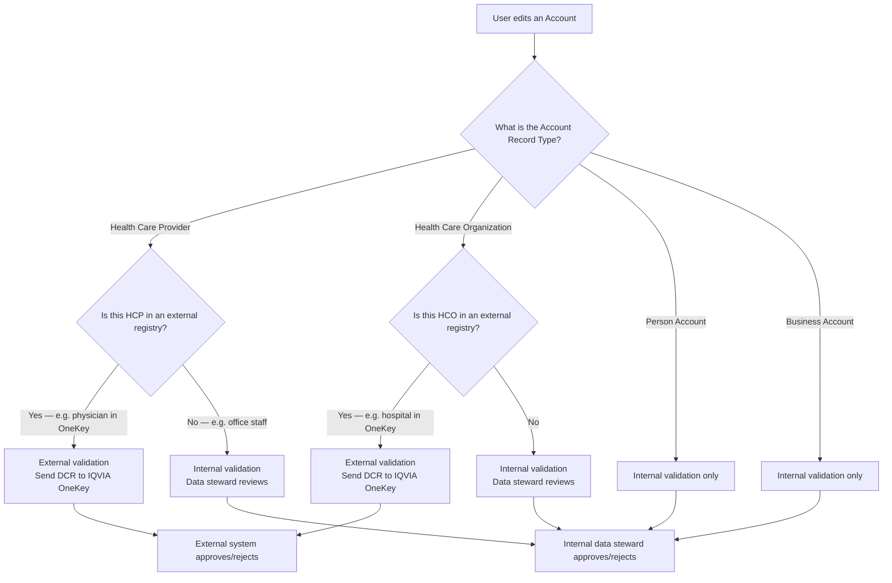
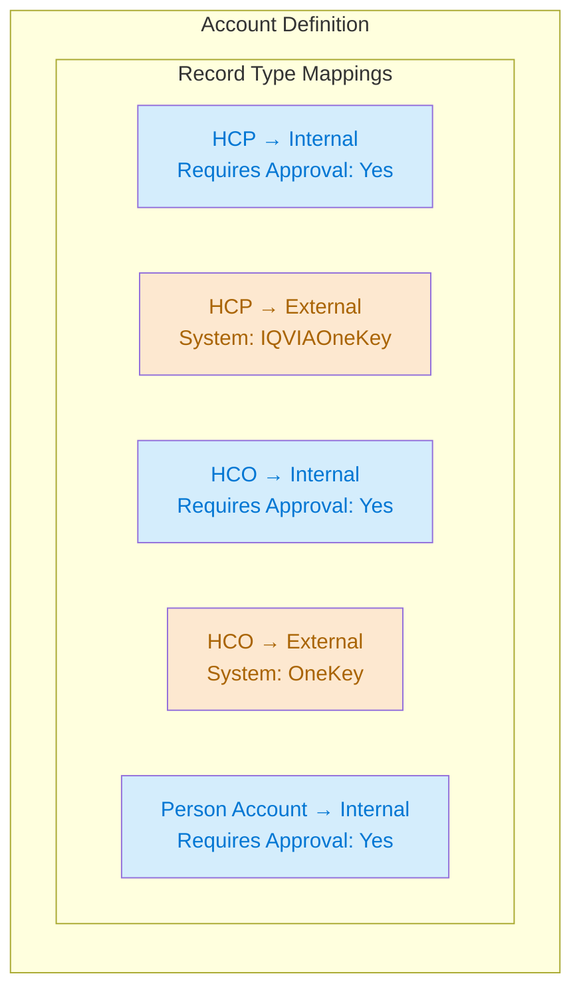
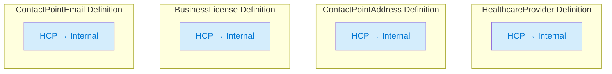
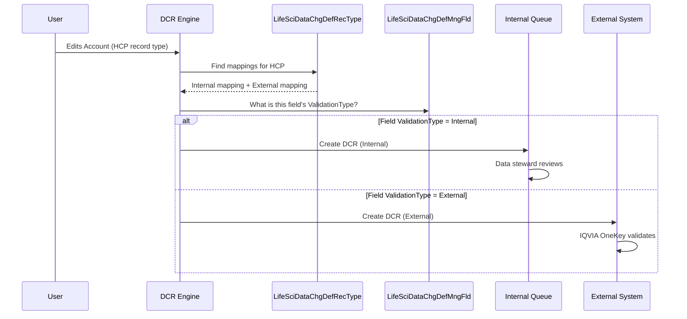
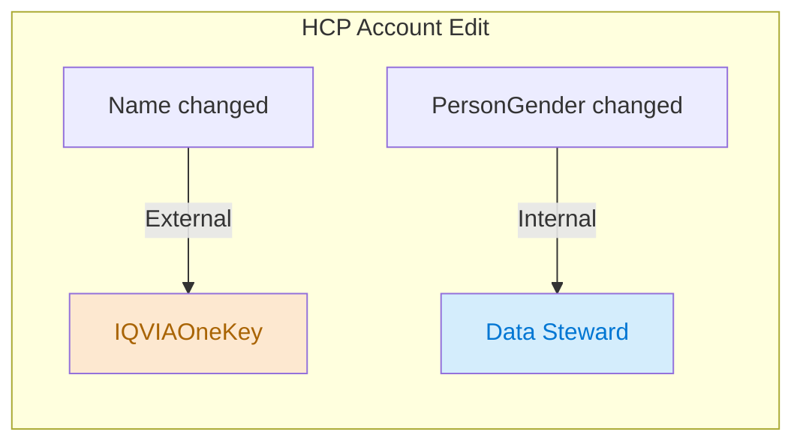
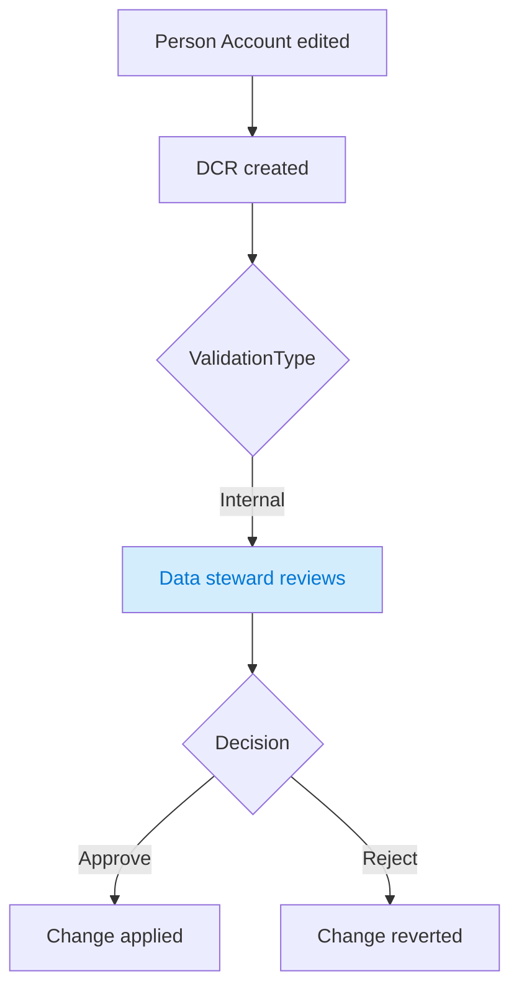
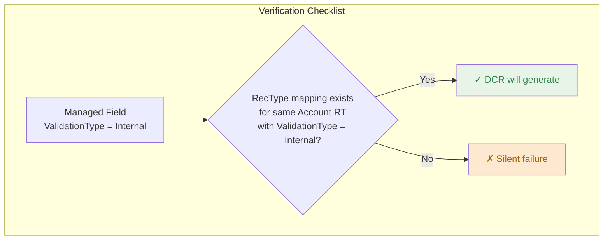

# DCR Validation Types & Record Type Routing

## Concept

Life Sciences organizations manage different types of accounts that require different validation workflows. Healthcare Providers (HCPs) and Healthcare Organizations (HCOs) are often validated by external third-party data providers like **IQVIA OneKey**, while internal staff accounts (office staff, nurses, etc.) are validated by the organization's own data stewards.

The DCR engine routes each change through the correct validation path based on the **Account record type**.

## Account Record Types

| Record Type | Typical Use | Examples |
|---|---|---|
| Health Care Provider (HCP) | Licensed medical professionals validated against external registries | Physicians, Surgeons, Dentists |
| Health Care Organization (HCO) | Medical facilities and organizations validated against external registries | Hospitals, Clinics, Pharmacies |
| Person Account | Internal staff and contacts not in external registries | Office managers, Sales contacts, Nurses (non-prescribing) |
| Business Account | Non-medical business entities | Distributors, Vendors |

## Why Different Validation Paths?

**External data providers** like IQVIA OneKey maintain authoritative registries of licensed healthcare professionals and organizations. When your Salesforce data changes, the DCR is sent to these systems for verification against their registry before the change is applied. This ensures your HCP/HCO data stays aligned with the industry-standard source of truth.

**Internal validation** is used for accounts that don't exist in external registries — office staff, administrative contacts, or business entities. These changes are reviewed and approved by your organization's data stewards.

## Record Type Mapping Configuration

Each `LifeSciDataChgDefRecType` maps an Account record type to a validation path. You need one mapping per Account record type per object definition.

### Recommended Setup: Account Object

In the Admin Console **Data Change Request Validation Types** screen, for the Account object, a typical multi-path setup looks like:

| Record Type | Validation Type | Requires Approval for Creation | External Validation System Name |
|---|---|---|---|
| Health Care Provider | Internal | Yes | — |
| Health Care Provider | External | No | IQVIAOneKey |
| Health Care Organization | Internal | Yes | — |
| Health Care Organization | External | No | OneKey |
| Person Account | Internal | Yes | — |

> **Note:** You can have both Internal and External mappings for the same record type. The DCR engine uses the managed field's `ValidationType` to determine which path a specific field change follows. See [Routing Logic](#how-the-engine-picks-the-path) below.

### Recommended Setup: Related Objects

Related objects (HealthcareProvider, ContactPointAddress, BusinessLicense, etc.) need their own record type mappings. They reference **Account record types**, not their own.

For a simple internal-only setup, each related object needs at minimum one mapping per Account record type you use.

## How the Engine Picks the Path

The matching chain:

1. **Account record type** determines which `LifeSciDataChgDefRecType` mappings are candidates
2. **Managed field's `ValidationType`** selects which candidate mapping to use
3. If the field is `Internal`, the DCR goes to the internal approval queue
4. If the field is `External`, the DCR is sent to the external system named in the mapping's `ExternalValidationSysName`

**Critical:** The managed field's `ValidationType` must match at least one record type mapping's `ValidationType` for that Account record type. If there's no match, the DCR is silently skipped.

## Example: Mixed Internal/External on the Same Object

An organization wants:
- `PersonGender` validated internally (it's not in external registries)
- `Name` validated externally (must match IQVIA OneKey)

### Record Type Mappings for Account

| Record Type | Validation Type | External System |
|---|---|---|
| Health Care Provider | Internal | — |
| Health Care Provider | External | IQVIAOneKey |

### Managed Fields for Account

| Field | ValidationType | What Happens |
|---|---|---|
| Name | External | DCR sent to IQVIAOneKey for validation |
| PersonGender | Internal | DCR reviewed by internal data steward |

If both fields change in the same save, two separate DCR records are created — one routed internally, one externally.

## External Validation Systems

### IQVIA OneKey

IQVIA OneKey is the industry-standard registry for healthcare professionals. It maintains a global database of HCPs with their credentials, affiliations, and specialties. When a DCR is sent to OneKey:

1. The DCR payload (old/new data) is transmitted to the OneKey integration endpoint
2. OneKey validates the change against their registry
3. OneKey responds with Approved, Rejected, or requires additional review
4. The DCR status is updated accordingly in Salesforce

**ExternalValidationSysName:** `IQVIAOneKey` (or as configured in your integration layer)

### Integration Requirements

For external validation to work:

- A middleware integration (MuleSoft, Dell Boomi, etc.) must be configured to receive DCR payloads and route them to the external system
- Every picklist value in Salesforce must have a corresponding mapping in the integration layer — mismatches cause "Missing Fields" errors
- External validation only supports Create and Update operations — Delete operations are rejected
- The `ExternalValidationSysName` on the record type mapping must match what the integration layer expects

## Person Account: Internal-Only Path

Person Accounts represent individuals who are not in external registries — office managers, administrative assistants, non-prescribing nurses, sales contacts. These accounts use the `Person Account` record type and are always validated internally.

For Person Accounts, you only need:
- One `LifeSciDataChgDefRecType` mapping: Person Account → Internal
- All managed fields should have `ValidationType = Internal`

There's no need for an External mapping since Person Accounts don't exist in external registries.

## Complete Setup Example

### Org with HCP (External + Internal), HCO (External), Person Account (Internal)

**Step 1: Record Type Mappings (Admin Console > Data Change Request Validation Types)**

| Object | Record Type | Validation Type | External System | Requires Approval |
|---|---|---|---|---|
| Account | Health Care Provider | Internal | — | Yes |
| Account | Health Care Provider | External | IQVIAOneKey | No |
| Account | Health Care Organization | External | OneKey | No |
| Account | Person Account | Internal | — | Yes |
| HealthcareProvider | Health Care Provider | Internal | — | Yes |
| ContactPointAddress | Health Care Provider | Internal | — | Yes |
| ContactPointEmail | Health Care Provider | Internal | — | Yes |
| BusinessLicense | Health Care Provider | Internal | — | Yes |

**Step 2: Managed Fields**

| Object | Field | ValidationType | Rationale |
|---|---|---|---|
| Account | Name | External | Must match external registry |
| Account | PersonGender | Internal | Not in external registries |
| HealthcareProvider | ProfessionalTitle | Internal | Validated by data steward |
| HealthcareProvider | ProviderType | Internal | Validated by data steward |
| ContactPointAddress | Address | Internal | Address changes reviewed internally |
| BusinessLicense | LicenseNumber | Internal | License numbers verified internally |
| ContactPointEmail | EmailAddress | Internal | Email changes reviewed internally |

**Step 3: Verify alignment**

For each managed field, confirm that a record type mapping exists with the same `ValidationType` for the Account record type(s) you use. If your HCP accounts use `Internal` managed fields, you need an `HCP → Internal` record type mapping.

## Common Mistakes

### 1. Missing record type mapping for related objects

HealthcareProvider, ContactPointAddress, etc. each need their own `LifeSciDataChgDefRecType`. They reference Account record types but the mapping must exist on the child object's definition.

### 2. Validation type mismatch

The managed field says `External` but the record type mapping says `Internal`. The engine finds no matching path and silently skips. Always check both sides match.

### 3. Only setting up External for HCP

If some HCP fields are validated internally (e.g., PersonGender), you need both an Internal AND External record type mapping for HCP. Without the Internal mapping, internal-validated fields on HCP accounts produce no DCR.

### 4. Forgetting Person Account

If your org uses Person Accounts for non-medical contacts, you need a `Person Account → Internal` mapping. Without it, changes to Person Account records are silently ignored by the DCR engine.
